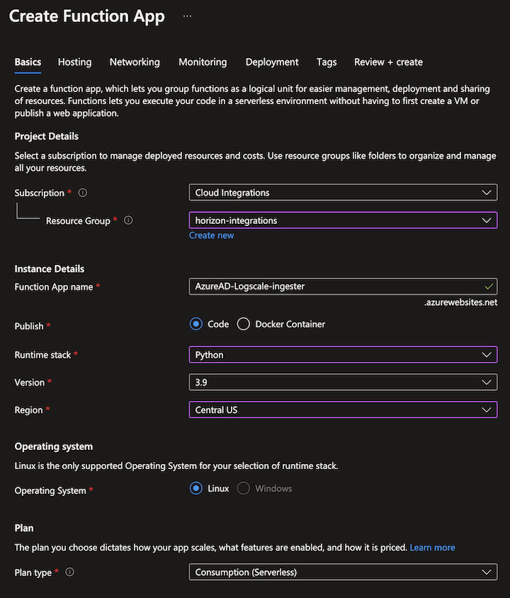

[](https://twitter.com/CrowdStrike)<br/>

# CrowdStrike LogScale ingester for Azure AD logs
  

This repository contains a collection of Azure Functions to process events in Event Hub and ingest the available events into LogScale via the HTTP Event Collector (HEC).

---
This Function App deployment is based on Azure Active Directory's Diagnostic Settings to stream logs to an Event Hub. From there the deployed Function App streams the logs to LogScale's HTTP Event Collector (HEC).

The Function App provides options for which AAD logs (Separated into Event Hub Instances) to ingest into logscale as well as auxiliary Event Hub Instances within the same Event Hub Namespace.


## Set Up ##

### 1. Set up a LogScale repository, parser, and ingest token
Refer to Logscale Documentation for:

* [Instructions to set up a new LogScale repository](https://library.humio.com/humio-server/repositories-create.html#repositories-create)
* [Instructions to set up a custom parser](https://library.humio.com/humio-server/parsers-create.html)
* [Instructions to generate the ingest token](https://library.humio.com/humio-server/ingesting-data-tokens.html#ingesting-data-tokens-generate#ingesting-data-tokens-generate)


The following script can be copied and pasted for the custom parser:

```
parseJson(@rawstring)
| split("records", strip=true) // Split into individual events 
| drop([@rawstring, _index]) // Clean up
```

### 2. Create a Resource Group within Azure
The Resource Group is a container where the following parts are going to reside. We recommend creating a new Resource group to have all the components for this integration bundled up.  Please refer to the Microsoft documentation for [creating a new Resource Group](https://learn.microsoft.com/en-us/azure/azure-resource-manager/management/manage-resource-groups-portal#create-resource-groups).

### 3. Create the Event Hub Namespace and Function App
The Event Hub Namespace will contain one or more Event Hubs Instances which are going to be created automatically with the next step. Please refer to the Microsoft documentation for [Event Hub Namespace setup instructions](https://docs.microsoft.com/en-us/azure/event-hubs/event-hubs-create). Once created, please add an access policy for the Function App in the "Shared access policies" tab with the "Listen" claim and note the "Connection string–primary key" which will be used in the Application Setting after the Function App has been deployed with the functions.

Additionally, an empty Function App needs to be created, as it will house all of the functions for ingesting the Azure AD events into LogScale. The Instance details should be setup as follows with the Resource Group, Function App Name, and Region being flexible.  



### 4. Set up Azure Active Directory's Diagnostic Settings to steam the events to the Event Hub Namespace
The setup for the Azure Active Directory's Diagnostic Settings can be found in [this resource](https://learn.microsoft.com/en-us/azure/active-directory/reports-monitoring/tutorial-azure-monitor-stream-logs-to-event-hub).

### 5. Setup Visual Studio Code and deploy the functions into the Function App
    1. Install Visual Studio Code and the Azure Functions extension in Visual Studio Code
    2. Clone the repository within Visual Studio code or download the repository and open it in Visual Studio Code
    3. In the Azure Extension, initialize the local project within the workspace window (Python 3.9.x)
    4. Once the function app is initiated, you can deploy the functions by clicking the "Deploy .../Deploy to Function App ..." button in the workspace window.
    5. Select the created Function App from main step 3.

### 6. Set the Application Settings for the Function App
Navigate to the Function app within the Azure portal and verify in the "Functions" tab that the functions were deployed correctly.  
The Application Settings are required, as they contain the values for the variables used for the Functions, aside from the standard variables, which do not need to be modified, there are 3 Application Settings which need to be added and modified with the corresponding values:
* AzureEventHubConnectionString (From main step 3)
* LogScale URL (The LogScale HEC URL "https://your-logscale-url.com/api/v1/ingest/hec/raw")
* LogScale Ingest token (From main step 1)
 The following Application settings needs be added via the "Advanced Edit" option prior to the closing bracket of the configuration with the last 3 values adjusted to the values mentioned above:

```
  {
    "name": "AAD_AUDIT_LOG_CONSUMER_GROUP",
    "value": "$Default",
    "slotSetting": false
  },
  {
    "name": "AAD_AUDIT_LOG_HUB_NAME",
    "value": "insights-logs-auditlogs",
    "slotSetting": false
  },
  {
    "name": "AAD_MANAGEDIDENTITY_SIGNIN_LOG_CONSUMER_NAME",
    "value": "insights-logs-noninteractiveusersigninlogs",
    "slotSetting": false
  },
  {
    "name": "AAD_MANAGEDIDENTITY_SIGNIN_LOG_HUB_NAME",
    "value": "insights-logs-noninteractiveusersigninlogs",
    "slotSetting": false
  },
  {
    "name": "AAD_NON_INTERACTIVE_SIGNIN_LOG_CONSUMER_GROUP",
    "value": "$Default",
    "slotSetting": false
  },
  {
    "name": "AAD_NON_INTERACTIVE_SIGNIN_LOG_HUB_NAME",
    "value": "insights-logs-noninteractiveusersigninlogs",
    "slotSetting": false
  },
  {
    "name": "AAD_SERVICE_PRINCIPAL_SIGNIN_LOG_CONSUMER_GROUP",
    "value": "$Default",
    "slotSetting": false
  },
  {
    "name": "AAD_SERVICE_PRINCIPAL_SIGNIN_LOG_HUB_NAME",
    "value": "insights-logs-serviceprincipalsigninlogs",
    "slotSetting": false
  },
  {
    "name": "AAD_SIGNIN_LOG_CONSUMER_GROUP",
    "value": "$Default",
    "slotSetting": false
  },
  {
    "name": "AAD_SIGNIN_LOG_HUB_NAME",
    "value": "insights-logs-signinlogs",
    "slotSetting": false
  },
  {
    "name": "AzureEventHubConnectionString",
    "value": "<Your Event Hub Connection String>",
    "slotSetting": false
  },
  {
    "name": "LogScaleIngestToken",
    "value": "<Your LogScale Ingest Token>",
    "slotSetting": false
  },
  {
    "name": "LogScaleURL",
    "value": "<Your LogScale URL>/api/v1/ingest/hec/raw",
    "slotSetting": false
  }
```

## Notes 
---
* Batching of multiple events coming from Azure as a single log in LogScale

## Future Additions
---
* Dashboard are currently not available, however will be published as a LogScale package on the Marketplace once available
* A more streamlined deployment method is currently in testing, which will replace the VS Code ARM deployment with a single "Deploy to Azure" Button

<p align="center"><BR/></P>
<h3><P align="center">WE STOP BREACHES</P></h3>
